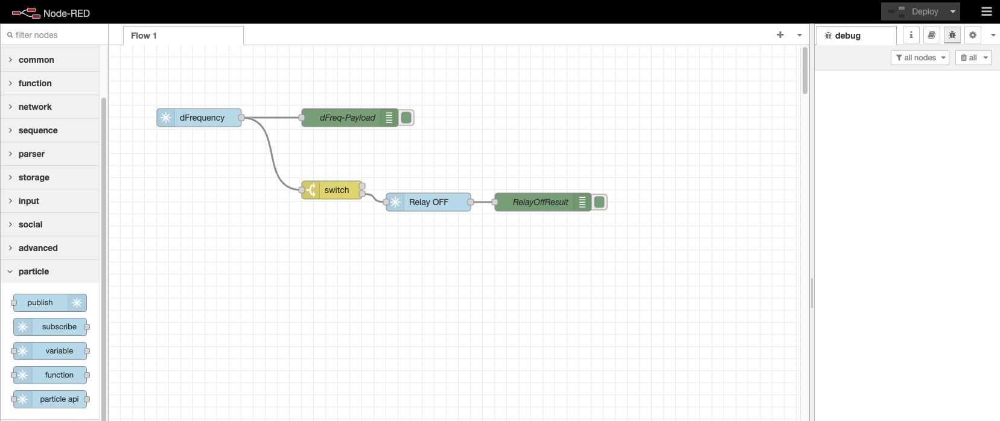
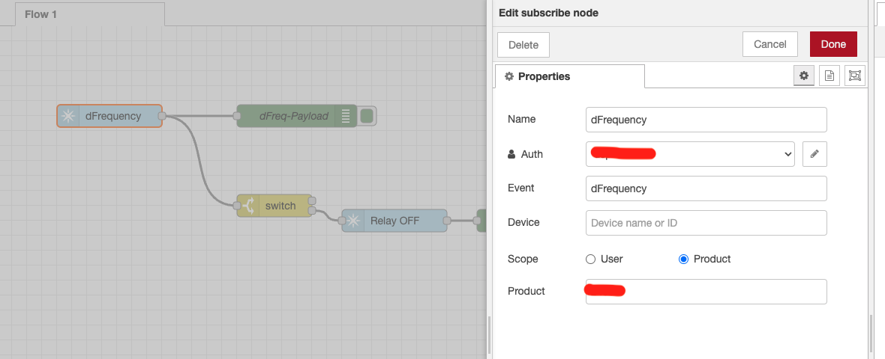
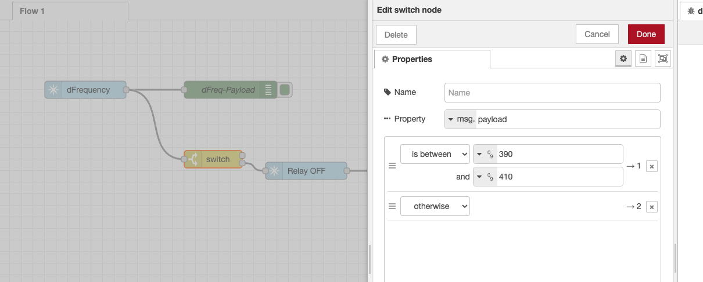
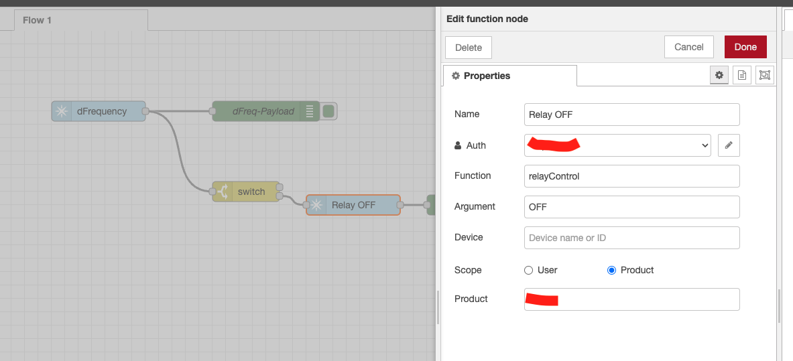

# Audio Demo

This demo shows audio processing in the Particle photon 2

The project takes 5 seconds of audio samples from the PDM microphone module and stores it in a SD card using .wav format with auto-incremental naming. Then it takes the first second of the saved sampling and performs FFT and MFCC computing to obtain the domimnant frequency and MFCC coefficients. Next it publishes the results on the particle cloud. The device is suscribed to an event from the cloud that can turn ON and OFF a relay module.

For triggering a sampling event, is possible to press the MODE button on the device or calling the function from cloud.

Compiled using VScode Particle Workbench 1.16.10 for deviceOS 5.5.0 and Photon 2.

### Cloud functions
Available from the console or cloud API:
* `audioSample` - Call this function to trigger a sampling and FFT compute analysis. Takes no arguments.
* `analyzeCoeff` - Call this function to trigger a MFCC coefficients compute on the last saved file. Takes no arguments.
* `relayControl` - Call this function to control the relay. Arguments: "OFF" , "ON". Whitout quotes.

### Cloud events
Responses from the device to the cloud:
* `dFrequency` - Dominant frequency value from the last sampling event.
* `coeff` - MFCC coefficient values from the last sampling event.

## Wiring
Photon 2 | SD module | PDM MIC | Relay module | Notes 
--- | --- | --- | --- | ---
GND|GND|GND|GND
VUSB|-|-|*|
3V3 | 3V3 | 3V | * |
S3  | CS |-|-
MO  |MOSI|-|-
MI|MISO|-|-
SCK| SCK|-|-
A1 | -|DAT|-
A0 | -|CLK|-
S4|-|-|S1|Input signal is inverted in the module (0V is ON)

*5V relays must be powered from VUSB pin,  3V relays not recommended if the module power source is the photon 2.

## Server side
This demo is intended to work along a webapp or some service in the cloud. The server would receive the `dFrequency` value and check if the dominantfrequency is between a preset value range. If the value is outside that range, the server can call `relayControl` to turn off the relay in the device.

As an example, a node-red server was built. The node-red project file is included in the extras folder as `flows.json`. Particle provides a basic set of nodes for interfacing to the cloud.

The instructions for setting up a nodered server can be [found here](https://nodered.org/#get-started).
The instructions for setup and use the particle node-red integration can be [found here](https://docs.particle.io/reference/cloud-apis/node-red/).

The dFrequency node is sucribed to the particle event with the same name, it passes the received value to the switch node. In this exmaple the switch is cofigured to trigger a `relayControl` event to turn off the relay if the value is outside 390Hz - 410Hz.

